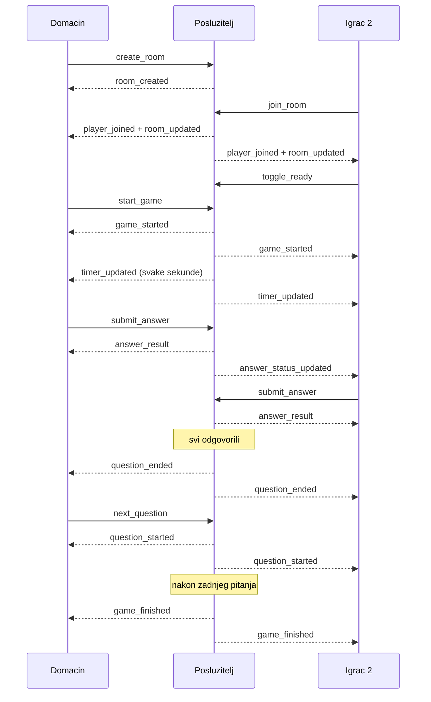

# Socket protokol

Opis komunikacije u stvarnom vremenu između klijenta i poslužitelja. Cijeli
real-time sloj implementiran je u `backend/src/game.gateway.ts`, a klijentska
strana u `frontend/app/room/page.tsx`.

## Osnovno

- **Transport:** Socket.IO 4.8, kroz `@nestjs/platform-socket.io`.
- **CORS:** dopušteno je samo podrijetlo iz `FRONTEND_URL`.
- **Stanje partije** (sobe, igrači, pitanja u tijeku, bodovi) drži se u memoriji
  poslužitelja, u `Map` strukturama. U bazu se sprema samo konačni rezultat, i to
  samo za prijavljene igrače. Ponovno pokretanje poslužitelja prekida sve aktivne
  partije.
- **Poslužitelj je autoritet.** Točnost odgovora i bodove računa isključivo on;
  klijent šalje samo tekst odabranog odgovora.

## Autentikacija

Prijava preko socketa nije obavezna. Ako klijent pošalje JWT u
`handshake.auth.token`, poslužitelj ga ručno provjerava i iz njega dobiva
`userId`. Bez tokena korisnik igra kao gost — ima samo nadimak.

HTTP guardovi se na WebSocket vezu ne primjenjuju, pa se token provjerava ručno,
a svi ulazni podaci validiraju vlastitim funkcijama umjesto DTO-ima.

Identitet se uvijek uzima iz tokena, nikad iz payloada. Zato poslužitelj
namjerno ignorira `userId` koji klijent pošalje u `join_user_channel` i
`nickname` u `send_message`.

## Događaji: klijent → poslužitelj

| Događaj | Payload | Tko smije | Ograničenje |
| --- | --- | --- | --- |
| `join_user_channel` | — | prijavljeni | — |
| `create_room` | `{ nickname, questionCount?, timePerQuestion? }` | svi | 5 / min, najviše 500 soba ukupno |
| `join_room` | `{ roomCode, nickname, reconnect? }` | svi | 20 / min |
| `leave_room` | `{ roomCode }` | igrač u sobi | 10 / min |
| `toggle_ready` | `{ roomCode }` | igrač u sobi | — |
| `set_category` | `{ roomCode, category }` | domaćin, prije starta | — |
| `set_difficulty` | `{ roomCode, difficulty }` | domaćin, prije starta | — |
| `update_settings` | `{ roomCode, questionCount?, timePerQuestion? }` | domaćin, prije starta | — |
| `start_game` | `{ roomCode, questionCount?, timePerQuestion? }` | domaćin, svi ostali spremni | — |
| `submit_answer` | `{ roomCode, answer }` | igrač u sobi, jednom po pitanju | — |
| `next_question` | `{ roomCode }` | domaćin, tek nakon kraja pitanja | — |
| `kick_player` | `{ roomCode, playerId }` | domaćin | — |
| `send_message` | `{ roomCode, message }` | igrač u sobi | 10 / 10 s |
| `send_room_invite` | `{ toUserId, roomCode }` | prijavljeni član sobe, uz prihvaćeno prijateljstvo | 5 / min |

Svaka neuspjela provjera vraća `error_message` s porukom na hrvatskom. Poslužitelj
na te događaje ne šalje potvrdu (`ack`), pa se klijent oslanja na događaje koje
dobije natrag.

> `send_room_invite` je jedini način slanja pozivnice. Preostali dio životnog
> ciklusa pozivnice — dohvat i odbijanje — ide REST rutama, jer se ne mora
> dogoditi u stvarnom vremenu.

### Validacija ulaza

| Provjera | Pravilo |
| --- | --- |
| kod sobe | 3–20 znakova |
| nadimak | 3–30 znakova |
| poruka u chatu | 1–300 znakova |
| kategorija | 1–50 znakova |
| odgovor | 1–300 znakova |
| broj pitanja | cijeli broj 1–50, inače 10 |
| vrijeme po pitanju | cijeli broj 5–120 s, inače 15 |

## Događaji: poslužitelj → klijent

| Događaj | Payload | Kada |
| --- | --- | --- |
| `room_created` | `PublicRoom` | nakon stvaranja sobe |
| `room_updated` | `PublicRoom` | pri svakoj promjeni stanja sobe |
| `player_joined` | `PublicRoom` | kad novi igrač uđe |
| `reconnected_to_game` | stanje sobe, pitanje, preostalo vrijeme | kad se igrač vrati u započetu partiju |
| `category_updated` | `{ category }` | nakon promjene kategorije |
| `game_started` | prvo pitanje i broj pitanja | nakon pokretanja igre |
| `question_started` | sljedeće pitanje | pri prelasku na novo pitanje |
| `timer_updated` | broj preostalih sekundi | svake sekunde |
| `answer_result` | `{ isCorrect, correctAnswer, pointsEarned, players }` | samo igraču koji je odgovorio |
| `answer_status_updated` | `{ answeredCount, totalPlayers }` | nakon svakog odgovora |
| `question_ended` | `{ players, answeredCount, totalPlayers }` | kad svi odgovore ili istekne vrijeme |
| `game_finished` | `{ players, room }` | nakon zadnjeg pitanja |
| `kicked_from_room` | — | igraču kojeg je domaćin izbacio |
| `new_message` | `{ nickname, message, createdAt }` | nakon poruke u chatu |
| `error_message` | tekst greške | pri svakoj neuspjeloj provjeri |

## Oblici podataka

Klijentu se nikad ne šalje interni objekt sobe, nego whitelist verzija bez polja
`questions`, jer ono sadrži točne odgovore.

```ts
PublicQuestion = { id, category, question, options }

PublicRoom = {
  code, hostId, hostUserId, players,
  currentQuestionIndex, started, acceptingAnswers,
  selectedCategory, selectedDifficulty,
  questionCount, timePerQuestion, maxPlayers
}

Player = {
  id, nickname, score, correctAnswers,
  answeredQuestions,   // indeksi pitanja na koja je igrač odgovorio
  userId, isReady, connected
}
```

Točan odgovor izlazi iz poslužitelja jedino kroz `answer_result`, i to tek nakon
što je igrač poslao svoj odgovor. Događaj `question_ended` ga ne sadrži.

## Tijek partije

1. Domaćin šalje `create_room` i dobiva `room_created` sa šesteroznamenkastim kodom.
2. Ostali igrači ulaze s `join_room`; svi u sobi dobivaju `player_joined` i `room_updated`.
3. U lobbyju domaćin bira kategoriju, težinu, broj pitanja i vrijeme; ostali potvrđuju
   spremnost s `toggle_ready`.
4. Domaćin šalje `start_game`. Poslužitelj dohvaća pitanja iz baze, miješa ih i uzima
   traženi broj, pa svima šalje `game_started` i pokreće tajmer.
5. Za svako pitanje: `timer_updated` svake sekunde, `submit_answer` od igrača,
   `answer_result` njemu i `answer_status_updated` svima.
6. Pitanje završava kad svi odgovore ili istekne vrijeme — svima ide `question_ended`.
7. Domaćin šalje `next_question`, ili poslužitelj nakon 30 sekundi sam nastavlja.
8. Nakon zadnjeg pitanja svi dobivaju `game_finished`, a rezultati prijavljenih igrača
   spremaju se u bazu.

## Posebni mehanizmi

**Bodovanje.** Netočan odgovor donosi 0 bodova. Točan donosi 1000 bodova uvećanih za
brzinski bonus `max(0, 500 - vrijeme_odgovora_u_ms / 30)`, pa bonus nakon 15 sekundi
padne na nulu. Bodovi se nikad ne oduzimaju.

**Prekid veze nije izlazak.** Osvježavanje stranice izgleda isto kao odlazak, pa se
igrač prvo samo označi kao odspojen i ostaje u sobi. Ako se ne vrati unutar 30
sekundi, soba se briše iz memorije. Namjerni izlazak (`leave_room`) uklanja igrača
odmah.

**Povratak u partiju.** Prijavljeni igrač prepoznaje se po `userId`, a gost po
nadimku i to samo ako je taj slot odspojen — inače bi drugi gost s istim nadimkom
preuzeo tuđe mjesto. Ako je partija u tijeku, dobiva `reconnected_to_game` s
preostalim vremenom izračunatim iz vremena početka pitanja.

**Zamjena domaćina.** Ako domaćin izgubi vezu, uloga se predaje prvom spojenom
igraču tek nakon 10 sekundi, da osvježavanje stranice ne uzrokuje zamjenu.

**Neaktivan domaćin.** Ako domaćin ne pokrene sljedeće pitanje unutar 30 sekundi
nakon kraja prethodnog, partija se nastavlja automatski.

**Kod sobe.** Šest znakova iz alfabeta bez `0`/`O` i `1`/`I`, generiranih kriptografski
sigurnim generatorom, uz ponovno generiranje ako kod već postoji.

## Dijagram — partija s dva igrača


